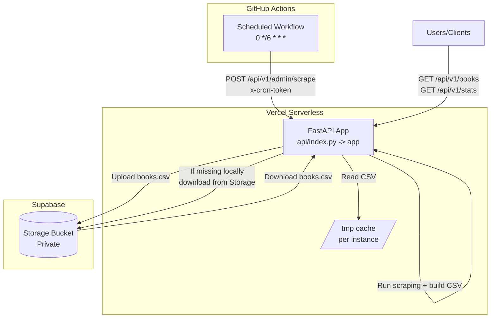
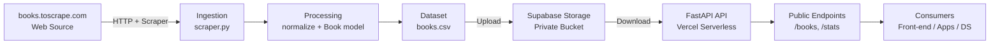
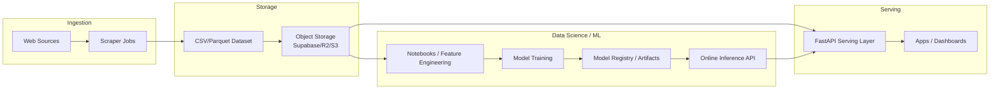

# 📚 BookFinder API

Public API for querying book data scraped from **books.toscrape.com**. It is a didactic backend project showcasing modern serverless architecture and best practices.

The project explores:

* FastAPI
* JWT Authentication
* Serverless deployment on Vercel
* Controlled web scraping via admin endpoints
* Persistent storage using Supabase Storage
* Automation with GitHub Actions (cron jobs)

---

## 🧱 Project Architecture

### High-level overview

```
Client
  └──> FastAPI (Vercel Serverless)
          ├── In-memory cache (per instance)
          ├── Local /tmp cache (per instance)
          ├── Supabase Storage (source of truth)
          └── GitHub Actions (cron)
```

### Core components

* **FastAPI** – REST API framework
* **Scraper** – Extracts book data from books.toscrape.com
* **Supabase Storage** – Persistent CSV storage across serverless invocations
* **JWT Authentication** – Protects admin endpoints
* **CRON_TOKEN** – Secure authentication for scheduled jobs
* **GitHub Actions** – Periodic scraping execution



### Data flow
<br>


<br>

1. `/admin/scrape` (cron or admin):

   * Runs the scraper
   * Generates `books.csv`
   * Uploads the file to Supabase Storage
2. Public endpoints:

   * Download CSV from Supabase if not cached locally
   * Load data from CSV
3. `/health`:

   * Does not scrape or download data
   * Reports API and data status only

---

## 📁 Project Structure

```
.
├── api
│   └── index.py               # Vercel entry point
├── src
│   └── bookfinder_api
│       ├── api/v1/routes      # API routes
│       ├── core
│       │   ├── auth           # JWT, cron token, dependencies
│       │   ├── data           # Repository layer
│       │   ├── ingestion      # Scraper
│       │   ├── storage        # Supabase integration
│       │   └── models         # Domain models
│       └── main.py            # FastAPI app initialization
├── vercel.json
├── pyproject.toml
└── README.md
```

---

## 🚀 Installation and Local Setup

### Prerequisites

* Python 3.11+
* Poetry
* Supabase account (Free tier)
* GitHub account (optional, for cron)

---

### 1️⃣ Clone the repository

```bash
git clone https://github.com/ricardobgarcia/bookfinder_api.git
cd bookfinder-api
```

---

### 2️⃣ Install dependencies

```bash
poetry install
```

---

### 3️⃣ Create `.env` file

```env
# Admin Auth
ADMIN_USER=admin
ADMIN_PASS=admin123
JWT_SECRET=super-secret-key
JWT_ALG=HS256

# Cron authentication
CRON_TOKEN=generate-a-secure-random-token

# Supabase
SUPABASE_URL=https://xxxx.supabase.co
SUPABASE_SERVICE_ROLE_KEY=eyJhbGciOi...
SUPABASE_BUCKET=bookfinder
SUPABASE_OBJECT_PATH=books.csv
```

⚠️ **Never commit `.env` files to version control**

---

### 4️⃣ Run the API locally

```bash
poetry run uvicorn src.bookfinder_api.main:app --reload
```

Access:

* Swagger UI: [http://localhost:8000/docs](http://localhost:8000/docs)
* Health check: [http://localhost:8000/api/v1/health](http://localhost:8000/api/v1/health)

---

## 🔐 Authentication

### JWT (Human admin)

Used for manual administrative access.

Endpoint:

```
POST /api/v1/admin/login
```

---

### CRON_TOKEN (Automated jobs)

Used by GitHub Actions or other schedulers.

Header:

```
x-cron-token: <CRON_TOKEN>
```

---

## 📌 API Routes

### 🔍 Health

#### `GET /api/v1/health`

Checks API and data status.

**Response (200):**

```json
{
  "status": "ok",
  "time": "2026-01-20T03:51:52",
  "cache": {
    "total_books_in_cache": 1000
  },
  "csv": {
    "local_exists": true,
    "remote_exists": true
  }
}
```

---

### 📚 Books

#### `GET /api/v1/books`

Returns a paginated list of books.

Query parameters:

* `page`
* `size`
* `category`
* `min_price`
* `max_price`
* `rating`

---

#### `GET /api/v1/books/top-rated`

Returns top-rated books.

---

#### `GET /api/v1/books/price-range?min=10&max=50`

Filters books by price range.

---

### 📊 Statistics

#### `GET /api/v1/stats/overview`

Returns global statistics:

* Total books
* Average price
* Rating distribution

---

#### `GET /api/v1/stats/by-category`

Returns statistics grouped by category.

---

### 🔧 Admin (Protected)

#### `POST /api/v1/admin/login`

Admin authentication.

Request:

```json
{
  "username": "admin",
  "password": "admin123"
}
```

Response:

```json
{
  "access_token": "...",
  "token_type": "bearer",
  "role": "admin"
}
```

---

#### `POST /api/v1/admin/scrape`

Triggers scraping and data refresh.

Authentication:

* `Authorization: Bearer <JWT>` **OR**
* `x-cron-token: <CRON_TOKEN>`

Response:

```json
{
  "status": "ok",
  "message": "Cache refreshed and CSV updated.",
  "total_books": 1000
}
```

---

## ⏱️ Automated Execution (Cron)

Scraping can be automated using **GitHub Actions**.

Example schedule:

```yaml
on:
  schedule:
    - cron: "0 */6 * * *"
```

Runs every 6 hours (UTC).

---

## ☁️ Deployment (Vercel)

* Serverless deployment
* Persistent storage via Supabase Storage
* `/tmp` used only as per-instance cache

All configuration is done via `vercel.json` and environment variables.

---

## 🧪 Tests

The `tests/` directory is prepared for:

* Unit tests
* Integration tests

*(TODO / future work)*

---

## 🚀 Scalability, Future Architecture and Machine Learning

**Scalability**
* The BookFinder API was designed with stateless and decoupled principles, enabling seamless horizontal scalability in serverless environments.

* The API layer is fully stateless, allowing multiple instances to handle requests concurrently.


**Future Architecture**

* As usage and data volume increase, the architecture can evolve incrementally:

  * Replace CSV with columnar formats (e.g., Parquet) for analytical workloads.

  * Introduce dataset versioning for reproducibility.

  * Migrate storage to a data warehouse if advanced analytics are required.


**Machine Learning Integration**

The architecture naturally supports Machine Learning workflows:

* Data scientists can consume datasets directly from object storage.

* Trained models can be deployed as API services.

* Future endpoints may support predictions and recommendations.

<br>

**General Schema**

<br>



---

## 📌 Important Notes

* `/health` never triggers scraping
* Public endpoints never perform scraping
* Scraping is restricted to admin endpoints
* Supabase Storage is the single source of truth
* Architecture designed for serverless environments

---

## 📜 License

This project was developed for educational purposes.
